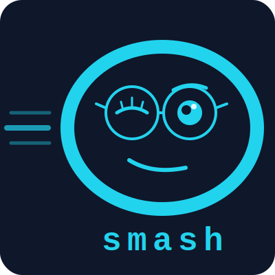

<p align="center">
  
</p>

# smash

**Unified encode/decode payload manager with AI semantic compression.**

`smash` is a single-file Bash tool for compressing and encoding content for transport between systems — particularly for passing large payloads through channels with size constraints (chat interfaces, clipboard, APIs, log pipelines). It extends traditional lossless compression with two AI-powered modes that exploit a fundamental insight about how compression actually works.

---

## The Compression Ideology

Most compression tools treat content as byte sequences. `smash --ai` treats content as *shared knowledge*.

The insight: compression is only possible when both the writer and reader share context. A ZIP file works because the algorithm can reference earlier bytes in the same stream. An LLM works because the model's trained weights encode billions of semantic equivalences — it knows that "configuration" and "cfg" are the same thing in a technical context.

The `--ai` mode formalizes this: rather than shipping a dictionary with every compressed file, it uses a domain-specific abbreviation table that any technical reader already has in their head. `configuration → cfg`, `authentication → auth`, `middleware → mw`. Combined with filler phrase removal, article stripping, and line-joining to maximize downstream xz context windows, this achieves ~25–40% of original size with no API, no network, no dependencies beyond `awk` and `xz`.

The `--ai-api` mode takes the same principle to its logical conclusion: instead of a hand-crafted 100-entry dictionary, use a large language model with billions of trained parameters as the shared-context lookup table. The model rewrites content at its absolute semantic minimum — ~5–10% of original size — preserving every fact while eliminating everything the reader can reconstruct from context.

This is not a new idea in information theory. It is a practical implementation of the principle that **compression ratio is bounded by shared knowledge between encoder and decoder**. Most tools ignore this. `smash` exploits it.

---

## Installation

**Homebrew (macOS / Linux):**
```bash
brew tap pbnkp/smash
brew install smash
```

**One-liner:**
```bash
curl -fsSL https://raw.githubusercontent.com/pbnkp/smash/main/install.sh | bash
```

Or manually:

```bash
curl -fsSL https://raw.githubusercontent.com/pbnkp/smash/main/smash -o ~/.local/bin/smash
chmod +x ~/.local/bin/smash
```

**Requirements:**
- bash 3.2+ (works with macOS system bash; `/usr/local/bin/bash` on FreeBSD)
- `xz` (lossless default; uses `-T0` multithreading when available)
- `gzip` (gz mode; `pigz` used automatically if installed)
- `openssl` (base64 encoding)
- `awk` (ai mode — stdlib, always present)
- `jq` + `curl` (ai-api mode only)
- `zstd` (only for `-z`/`--zstd` mode — opt-in)

---

## Usage

```bash
smash <file>                    # encode file (xz + base64, lossless default)
smash <directory>               # auto-tar + encode directory
smash -g <file|dir>             # encode with gzip (or pigz) instead of xz
smash -z <file|dir>             # encode with zstd (fast modern, opt-in)
smash --ai <file|dir>           # native semantic compress + xz  (~25-40%)
smash --ai-api <file|dir>       # LLM API compress + xz          (~5-10%)
smash -d <file.[xz|gz|zst].b64.*>  # decode (format auto-detected)
smash -s "text string"          # encode a string directly
smash --edit                    # open $VISUAL/$EDITOR, encode on save
smash                           # interactive paste mode (Ctrl+D to finish)
```

**Options:**

| Flag | Description |
|---|---|
| `-d`, `--decode` | Decode mode. Reverses base64 + decompression. Auto-detects xz/gz/zst/ai. |
| `-g`, `--gz` | Use gzip instead of xz (faster, wider compat; uses `pigz` if installed) |
| `-z`, `--zstd` | Use zstd instead of xz (fast, modern; needs `zstd` to encode and decode) |
| `-x`, `--xz` | Use xz (default, explicit; multithreaded via `-T0`) |
| `--ai` | Native semantic compression. No API. Fast. ~25-40% of input. |
| `--ai-api` | LLM API compression. Needs API key. ~5-10% of input. |
| `--level N` | Compression level override (xz/gz `1-9`, zstd `1-19`) |
| `--threads N` | xz/zstd thread count (default `0` = all cores) |
| `-q`, `--quiet` | Suppress progress output (errors still print) |
| `-s "text"` | Encode a string instead of a file |
| `-o`, `--output` | Output path (decode mode) or output directory (encode mode) |
| `--edit` | Open `$VISUAL`/`$EDITOR` (multi-word safe); falls back nano→pico→vi→vim |

---

## Output Format

Encoded files are named by convention:

```
<basename>.<compression>.b64.<timestamp>

Examples:
  config.json.xz.b64.260507_143022        # lossless xz
  config.json.gz.b64.260507_143022        # lossless gzip
  config.json.zst.b64.260507_143022       # lossless zstd
  notes.txt.ai.xz.b64.260507_143022      # AI semantic + xz
  project.dtar.xz.b64.260507_143022      # directory (tar + xz)
```

The `.dtar` extension marks a tarred directory — `smash -d` automatically extracts it back to a directory on decode.

---

## AI Modes in Depth

### `--ai` — Native Semantic Compression

No API. No network. Requires only `awk`.

**Pipeline:**
1. Strip comment-only lines, blank lines, decorative dividers
2. Collapse whitespace, flatten indentation
3. Remove filler phrases ("in order to" → "to", "it is important to note that" → "")
4. Remove weak verbs and articles (reconstructable from context)
5. Abbreviate words via 100+ entry tech domain dictionary (word-by-word, case-preserving)
6. Deduplicate consecutive identical lines
7. **Join short lines into 250-char blocks** (gives xz a larger sliding window → better final ratio)
8. Compress with xz, encode as base64

**Sample abbreviation dictionary (partial):**
```
configuration → cfg    authentication → auth   middleware → mw
database → db          endpoint → ep           dependency → dep
parameter → param      environment → env       implementation → impl
transaction → txn      connection → conn       variable → var
```

**Typical ratios (before final xz+base64):**
- Dense technical prose: 40–60% reduction in text stage
- Verbose documentation: 60–75% reduction in text stage
- Already-dense configs: 10–20% reduction in text stage

Combined with xz on top, total base64 output for verbose prose often reaches 5–10% of original — the same territory as `--ai-api`, without the API call.

### `--ai-api` — LLM Semantic Compression

Feeds content through any LLM API and lets the model rewrite it at maximum semantic density.

**Supported APIs (auto-detected from environment):**

| Environment variable | Provider | Default model |
|---|---|---|
| `ANTHROPIC_API_KEY` | Anthropic (api.anthropic.com) | claude-sonnet-4-6 |
| `OPENAI_API_KEY` | OpenAI (api.openai.com) | gpt-4o-mini |
| `B64_AI_URL` (+ optional key) | Any OpenAI-compatible API | llama3 (local default) |

**Local model support** (no API key required):
```bash
export B64_AI_URL=http://localhost:11434/v1/chat/completions  # Ollama
export B64_AI_URL=http://localhost:1234/v1/chat/completions   # LM Studio
export B64_AI_URL=http://localhost:8080/v1/chat/completions   # llama.cpp server
```

**Compression system prompt (verbatim):**
```
You are a precision compression engine. Distill the input to its absolute essence.

RULES:
- Preserve ALL: facts, numbers, values, names, paths, configs, code, schemas, relationships, constraints
- Remove ONLY: redundancy, verbose explanation, filler words, repeated context
- Use dense shorthand: abbreviations, compact notation, implied structure
- Reference well-known concepts by name instead of explaining them
- For code: keep logic and structure, strip comments and whitespace
- For configs: keep all keys and values, compact formatting
- For prose: extract facts and relationships, drop narrative
- NEVER add commentary, framing, or meta-text about the compression
- NEVER omit information — compress representation, not content
- Target: 10% of input size or less
```

**Security:** API keys and payloads are passed via curl `-K tmpfile` and `-d @tmpfile` — never on the command line where `ps` would expose them.

---

## Environment Variables

| Variable | Purpose | Default |
|---|---|---|
| `B64_OUTDIR` | Output directory for encoded files | Same dir as input, or `~/smashes/` |
| `B64_AI_URL` | API endpoint (overrides auto-detect) | — |
| `B64_AI_KEY` | API key (overrides auto-detect) | — |
| `B64_AI_MODEL` | Model name override | Provider default |
| `ANTHROPIC_API_KEY` | Auto-detected for Anthropic | — |
| `OPENAI_API_KEY` | Auto-detected for OpenAI | — |

---

## Examples

**Basic encode/decode:**
```bash
# Encode a config file for clipboard transport
smash config.yaml
# → config.yaml.xz.b64.260507_143022

# Decode it on the other end
smash -d config.yaml.xz.b64.260507_143022
# → config.yaml (restored)
```

**AI compression for a large document:**
```bash
smash --ai large-doc.md
# smash: ai: 48234B -> 19847B (41% text, before xz+b64)
# smash: total: 48234B -> 8203B b64 (17%)
# encoded: large-doc.md.ai.xz.b64.260507_143302
```

**LLM compression with Anthropic:**
```bash
export ANTHROPIC_API_KEY=sk-ant-...
smash --ai-api large-doc.md
# smash: ai-api: 48234B -> 4891B (10% text, before xz+b64)
# smash: total: 48234B -> 1204B b64 (2%)
# encoded: large-doc.md.ai.xz.b64.260507_143401
```

**Compress an entire project directory:**
```bash
smash --ai ./my-project/
# Compresses all text files, tars, xz+b64 encodes
# → my-project.dtar.ai.xz.b64.260507_143500

# Restore it
smash -d my-project.dtar.ai.xz.b64.260507_143500
# → my-project/ (extracted)
```

**Encode a string:**
```bash
smash -s "$(cat /etc/nginx/nginx.conf)"
```

**Interactive paste mode:**
```bash
smash
# Paste your content, then Ctrl+D
```

---

## Use Cases

- **AI context compression:** Reduce token usage when feeding large documents into LLM context windows. Feed the compressed form — all facts preserved, prose overhead removed.
- **Cross-system transport:** Encode large payloads for transport through channels with size limits (chat, clipboard, log entries, API bodies).
- **Blob injection:** The encoding format (`/Td6WFo...` for XZ) is recognizable — useful when you need to identify smash-encoded content in logs or chat history.
- **Archival:** Long-term storage of session artifacts, conversation histories, or project snapshots at dramatically reduced size.
- **Local model compression:** Use a local Ollama/LM Studio model as the compression backend — full air-gapped operation, no data leaves your machine.

---

## Platform Notes

- **FreeBSD:** Change shebang line from `#!/usr/bin/env bash` to `#!/usr/local/bin/bash`. The tool was originally developed on FreeBSD 12.1 (wolowitz).
- **macOS:** Works with the system bash (3.2) — the full test matrix (encode/decode for xz·gz·zstd·dir, `--edit`, options) passes under `/bin/bash` 3.2; the `--ai-api` code path is exercised under 3.2 too, sans the live LLM call. No `brew install bash` required.
- **Linux:** No changes needed.

---

## Questions / Contributing

**Found a bug or have a question?** → [Open an issue](https://github.com/pbnkp/smash/issues)

**Want to contribute?** PRs welcome — especially:
- New abbreviation entries for the `--ai` dictionary
- Platform compatibility fixes
- Additional filler phrase patterns
- New `--ai-api` provider support

The compression ideology is the core of this project. If you have ideas for exploiting shared domain knowledge more aggressively, that's the most interesting place to push.

---

## License

MIT — see [LICENSE](LICENSE)

---

## Author

pbnkp · [github.com/pbnkp](https://github.com/pbnkp)
